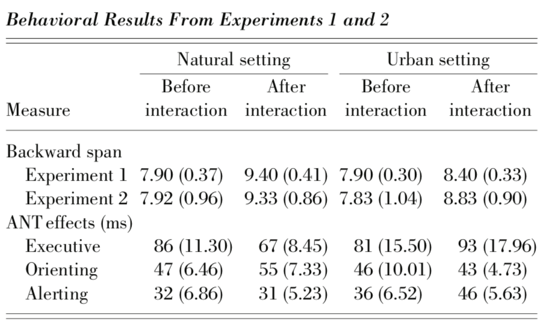

# Research Practicum 2018 – Research Plan (Template)
(text between brackets to be removed)

> * Group Name: Back to nature (- for less stress)
> * Group participants names: Andres Hanchi, Markus Loennig, Marc Mailloux
> * Project Title: Restorative benefits of **virtual reality** nature for the **recovery of attentional fatigue** and **stress reduction**

## General Introduction

(States your motivation clearly: why is it important / interesting to solve this problem?)

In order to solve problems, deliver outstanding work or just to work focussed and concentrated on a task requires to voluntarily direct attention. 
According to Kaplan, S.(1995), this focus of attention, the deliberate mental activity in the face of (negatively impacting) distraction requires effort and is suspectible to fatigue. 
Directed attention is a key ingredient in human effectiveness and achievments and therefore its fatigue can have severe consequences (e.g. airplane pilots, nuclear power plant operators, brain surgeons).

(Add real-world examples, if any)

There are several areas where directed attention is vital, be it in medicine, engineering or piloting, just to name a few. But it has much broader real live implications. Directed or focussed attention is needed for most of our daily activities, even in the university as a student. While not being vital per definition, the ability to work in a concentrated fashion to deliver outstanding work decides over students grades and therfore also at least partly over their/our future. Recovery from directed attention fatigue restores effectiveness, which will have an immediate impacts of the overall, general live situation (better, more effective time management).  

(Put the problem into a historical context, from what does it originate? Are there already some proposed solutions?)

The observation of "voluntary attention", its effects and needs were first descibed by William James (1892). Since then the theory and research have been on hold until about 1985. Most current research was done by Stephen Kaplan.  

(I tell sutdents to answer the questions, one paragaph each to start if you are lost)

(Problem Statement. One paragraph to describe the prob-lem that you are tackling.)

Acknowledging that directed attention is highly important and that this process is suspectible to fatigue, how can it be restored?

(Motivation. Why is this problem interesting and relevant to the research community?)

Improving effectiveness, restoring focus and improving the ability to inhibit distractions is self explainatory.  

(Proposed Solution. How do we propose to tackle this problem (that has been identified in the previous para-graphs, is interesting to the community, and has yet to be tackled by other researchers)?)

In the context of restoring attention and relieving stress, viewing or immersing in nature has repeatedly shown positive effects. Our research aims at validating/reconstructing some of the more recent research by using nature scenes under Virtual Reality.    

(Contributions. An enumeration of the contributions of the senior design project)

(This project makes the following contributions:)(you must have this!!)
•	(Contribution 1)
•	(Contribution 2)

## Related Work

Discuss briefly about published matter that technically relates to your proposed work in 4-5 paragraphs.

The article under review was The Cognitive Benefits of Interacting with Nature by Marc Berman, John Jonides, and Stephen Kaplan in the journal of Psychological Science. The purpose of this experiment was to validate the Attention Restoration Theory which states that interacting with nature will restore ones ability to focus specifically direct attention. Early in the article the authors use other references to use their frameworks and apply it in a different setting to be validated. To be more specific the authors hypothesis was walking in nature or looking at a photo of nature will improve directed-attention abilities as measured with a backwards digit-span task and the Attention Network Task, thus validating attention restoration theory. Lastly, Students from the university of Michigan, 23 females, 15 males, average age 22.62 years, and all participants were paid $20
	The methodology for Experiment 1 is as follows. Participants were given the Positive and Negative Affect Schedule (PANAS) to assess current mood, then asked to repeat sequences of numbers ranging from 3 to 9 backwards. After the backwards digit-spanning task the participants were given a directed-forgetting task that involved the suppression of information in short-term memory, which was used to fatigue participants further. The task consisted of 144 trials and lasted for 35 min. The participants were then randomly picked to take a nature walk or urban walk for 50 to 55mins, and a GPS tracker were given to the participants to ensure they were in the right setting. After the walks the participants were given the backwards digit-spanning task again along with the PANAS assessment, finishing the experiment.A week later participants were given the same procedure again, while walking in a complimentary position.
	The methodology for experiment 2 is as follows.  Participants were given the PANAS, and the backwards digit-spanning task as in experiments 1. In contrast to experiment 1, the participants were given the Attention Network Test(ANT) which identifies three different attentional functions: Alerting, Orientating, and Executive Attention. (We predicted that interactions with nature would improve only executive functions, but not alerting and orienting, because these latter two functions require less cognitive control compared to executive functions). After the ANT, participants were shown pictures of either nature scenes or urban city scenes for 10mins, where each photo was shown for 7s. After each photo the participant rated from 1 to 3 how much they liked the photo. Once finished with all of the phots, the participants performs the backwards digit-spanning task, the ANT, and the PANAS assessments again. The participants came a week later to repeat the procedure but with complimentary photos.
	The setting of the research was taken place in the researchers office/lab at the University of Michigan, and when on walks the Ann Arbor Downtown and the Ann Arbor Arboretum areas. The data collected can be seen below in Figure 1.
	
							Figure 1
												
From looking at the Experiment 1’s results the values are both higher after the walks but the natural setting is higher in the Backward Span Measure. In experiment 2 the results closely followed for the Backward span measure. Additionally looking at the ANT measure effects there were some mixed results, although the authors hypothesized only the executive functions would decrease in the participants in the natural setting. The participants in the urban setting actually took longer on their executive and alerting levels. This study accomplished its objectives and can be seen from the experiment results. In experiment 1 as participants in the natural setting vastly improved their results after their walk vs the urban setting participants. Additionally in experiments 2 the authors repeated the studies in experiment 1 and the results were replicated. Lastly the ANT measures show that after the participants view photos of natural settings their executive cognitions increase. This is because directed attention involves executive tasks and can be restored through ART methods.The authors concluded that they “can be confident that directed-attention mechanisms were restored in these studies because only portions of the ANT that involved directed attention were improved by interactions with nature”. They also noted each of the experiments showed “consistent improvement on the backwards digit-span task as a function of interactions with nature”.
	The authors point out at the end other comparison methods that also restores the directed attention. I think a third and fourth set could of been looked at. For example adding someone who meditates after the first assessments, and assess them after they have meditated and see how the compared to those in nature. Also agree that their conclusions are reasonable because their results and research design was concise at addressing the hypothesis. The researchers made sure to have truthful data to analyze when they were performing experiments. Additionally they performed the 2nd experiment different from actually being in nature and instead looking at a photo. This helps to see that the setting doesn’t matter but possibly the participants perception as participants for the natural and urban settings were just sitting in chairs looking at the respective photos. Either or it is the direct influence of Nature that seems to have a restorative effect and through their experiments and results this can be seen.

	Another report discusses the results of a study conducted using Attention Restoration Theory (ART) delivered through Virtual Reality (VR), 18 subjects took part in this study, 9 males and 9 females between the ages of 20 and 44. During this study, a head mounted display device such as the Oculus VR was used to immerse the subjects into three different scenes, one rural scene without any nature settings and two other nature scenes. 
	This study posed 2 hypotheses, the first one claimed that nature scenes can reduce stress better than non-nature scenes, while the second hypothesis stated that the preference of the nature scene will have more restorative results than the other nature scene. Several devices were used to record stress level activity, questionnaires were also used to assess the perception the subject’s perception of their own stress level.
	During the experiment the subjects wore the monitoring the devices to create a baseline, then a timed math test was provided to induce a certain stress level on the subjects, after raising the stress level, the subjects were placed under the VR scenes for 15 minutes. This process was repeated again with all of the other scenes and the order of the scenes were randomized. The monitoring devices recorded stress level throughout the whole experiment, while the questionnaires were provided to the subject before and after the VR sessions. 
	The study produced results in accordance with the first hypothesis. The subject displayed and expressed that after being stressed, the natural scene relieved stress more significantly than the non-nature scene. On the other hand, the second hypothesis did not show a significant difference between the nature scene of choice and the other nature scene according to the monitoring sensors, but according to the perception of the subjects it did.

## References 

Berman, M. G. (2008). The restorative benefits of interacting with nature: Cognitive and neuroscientific perspectives. PsycEXTRA Dataset. doi:10.1037/e533002014-001

Anderson, A. P., Mayer, M. D., Fellows, A. M., Cowan, D. R., Hegel, M. T., & Buckey, J. C. (2017). Relaxation with Immersive Natural Scenes Presented Using Virtual Reality. Aerospace Medicine & Human Performance, 88(6), 520–526. Retrieved from https://login.ezproxy.net.ucf.edu/login?auth=shibb&url=https://search-ebscohost-com.ezproxy.net.ucf.edu/login.aspx?direct=true&db=sph&AN=123479076&site=eds-live&scope=site

#Research Methods

I had some thoughts, we could use the same method in the paper I read and did my lit review on and use the backwards digit span task. I was also thinking we should assess different types of senses in terms of attention. So for instance a sound test (where users acknowledge if they heard a number amount of beep in a specified ear), or a visual test like this: https://www.youtube.com/watch?v=_bnnmWYI0lM
So I guess we would do something similar but just test for more senses relative to attention with the assessments and VR. In essense Assessments -> VR relaxation -> reasssessment -> repeat -> analysis results
	
Let me know what you guys think!
-Marc 

